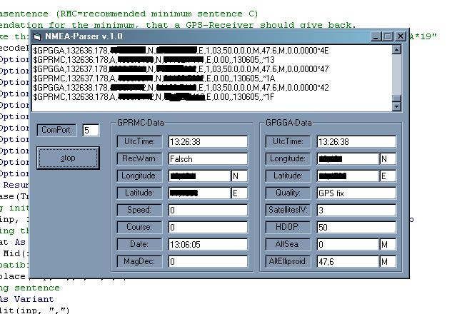



## NMEA GPS Parser v\.1\.0 for RMC and GGA Sentences

### Description

Connecting to a GPS-Receiver with MsComm control, this code will parse the datasentences RMC and GGA from a NMEA-Stream and show them in an adequate way.

Compatibility functions (Round,Replace,Split) for VB5 are included.

Comments and variablenames etc in english, used Option Explicit in Main-Module. Please vote if you like it and comment, if you have questions or constructive ideas.

PS: Maybe there will be a next version with support for GSV and GSA Datasentences.

[UPDATE INFO: I had a loss of precission failure in the module that changed position about 20 km *g* sorry for that, its ok now!]
 
### More Info
 

             |
---                |---
**Submitted On**   |2005-06-13 12:38:02
**By**             |[NexNo](https://github.com/Planet-Source-Code/PSCIndex/blob/master/ByAuthor/nexno.md)
**Level**          |Intermediate
**User Rating**    |5.0 (20 globes from 4 users)
**Compatibility**  |VB 4\.0 \(32\-bit\), VB 5\.0, VB 6\.0
**Category**       |[Complete Applications](https://github.com/Planet-Source-Code/PSCIndex/blob/master/ByCategory/complete-applications__1-27.md)
**World**          |[Visual Basic](https://github.com/Planet-Source-Code/PSCIndex/blob/master/ByWorld/visual-basic.md)
**Archive File**   |[NMEA\_GPS\_P1900956132005\.zip](https://github.com/Planet-Source-Code/nexno-nmea-gps-parser-v-1-0-for-rmc-and-gga-sentences__1-61103/archive/master.zip)

### API Declarations

No WindowsAPI used at all, just MsComm Control.

